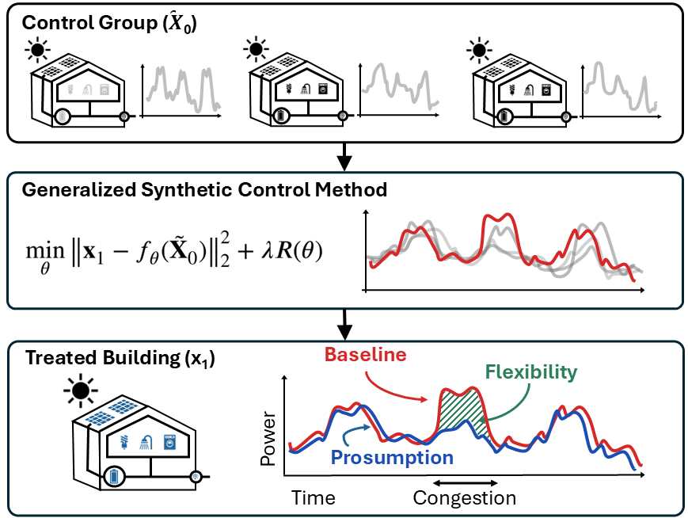

# Generalized Synthetic Control Method (GSCM) for Baseline Estimation

  A generalized synthetic control framework for dynamic baseline estimation in Demand Response electricity markets.

---

## Paper

The full mathematical detail, experimental setup, and results are available in the paper:

📄 **[ACC_Github_Generalized_SCM.pdf](ACC_Github_Generalized_SCM.pdf)**

---

## Abstract

  

Baseline estimation is critical to Demand Response (DR) settlement in electricity markets, yet existing machine learning methods remain limited in predictive performance, while methodologies from causal inference and counterfactual prediction are still underutilized in this domain.

We introduce a *Generalized Synthetic Control Method (GSCM)* that builds on the classical *Synthetic Control Method (SCM)* from econometrics. While SCM provides a powerful framework for counterfactual estimation, the classical formulation remains a static estimator: it fits the treated unit as a combination of contemporaneous donor units and therefore ignores predictable temporal structure in the residual error.

We develop a generalized SCM framework that transforms baseline estimation into a dynamic counterfactual prediction problem by augmenting the donor representation with exogenous features, lagged treated load, and selected lagged donor signals. This enriched representation allows the estimator to capture autoregressive dependence, delayed donor-response patterns, and error-correction effects beyond the scope of standard SCM.

The framework further accommodates nonlinear predictors when linear weighting is inadequate, with the greatest benefit arising in limited-data settings. Experiments on the Ausgrid smart-meter dataset show consistent improvements over classical SCM and strong benchmark methods, with the dominant performance gains driven by dynamic augmentation.
